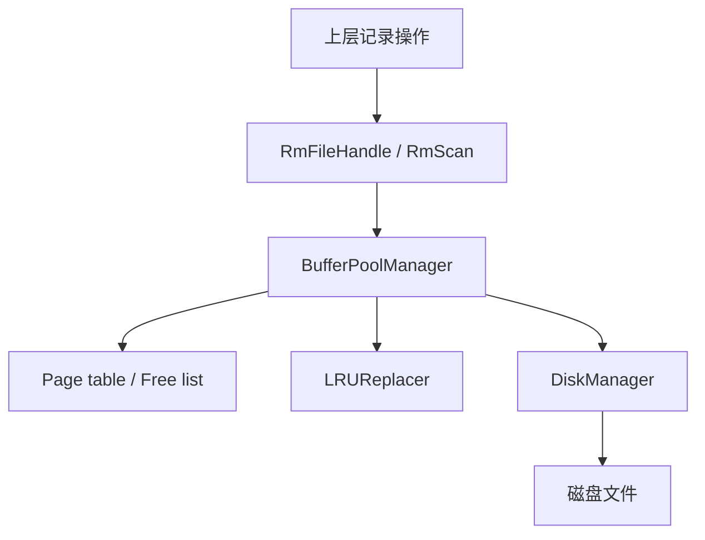
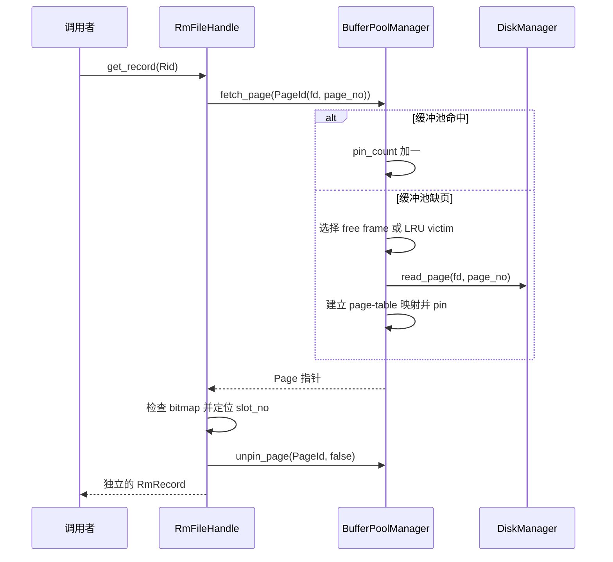

# RMDB Stage 1：从文件到记录的整体理解

`stage1.md` 给出了需要完成的接口；本文关注这些接口为什么被分成几层，以及数据如何在这些层之间流动。

Stage 1 要打通的是一条最基础的存储链路：**表中的定长记录存放在页面中，页面按需进入缓冲池，缓冲池最终通过文件接口读写磁盘。**

可以先记住两条索引关系：

```text
path → fd → PageId(fd, page_no) → frame_id → Page
                         │
                         └── Rid(page_no, slot_no) → page 内的一条 Record
```

- `PageId` 在整个缓冲池中标识一个页面，因此同时包含 `fd` 和 `page_no`。
- `Rid` 在一个已经确定的记录文件中标识记录，因此只包含 `page_no` 和 `slot_no`；它所属的 `fd` 由当前 `RmFileHandle` 提供。
- `frame_id` 不是磁盘地址，而是页面当前位于缓冲池数组中的位置。同一个 frame 在不同时刻可以承载不同的 Page。

## 1. 类与职责

### 1.1 错误类型：把底层失败变成项目语义

`RMDBError` 是项目异常的基类。Stage 1 主要接触两组派生错误：

- 文件错误：`UnixError`、`FileNotOpenError`、`FileNotClosedError`、`FileExistsError`、`FileNotFoundError`。
- 页面和记录错误：`InternalError`、`PageNotExistError`、`RecordNotFoundError`、`InvalidRecordSizeError`。

它们位于普通返回值和上层逻辑之间。例如，`open` 返回 `-1` 只是一次系统调用失败；`DiskManager` 再结合 `errno` 将其转换成“文件不存在”或其他 Unix 错误。这样，上层不需要理解每个系统调用的错误约定。

职责边界是：**系统调用负责报告事实，DiskManager 等模块负责把事实翻译成数据库能够理解的异常。**

### 1.2 DiskManager：把文件看成页面数组

`DiskManager` 是 Stage 1 最靠近文件系统的一层。它管理：

- `path2fd_`、`fd2path_`：文件路径与已打开文件描述符之间的双向关系。
- `fd2pageno_`：每个文件下一个可分配的页号。
- 文件和目录的创建、打开、关闭、删除。
- 指定文件中指定页面的读写。

对上层而言，一个文件不是任意字节流，而是由固定大小的页面组成：

```text
page 0        page 1        page 2
[0, 4096)     [4096, 8192)  [8192, 12288) ...
```

所以页号到文件偏移的换算始终是：

```text
file_offset = page_no × PAGE_SIZE
```

`DiskManager` 不理解页面内部存了什么，也不管理页面是否正在使用。它只负责“哪个文件、哪一页、读写多少字节”。

### 1.3 PageId 与 Page：页面身份和页面内容

`PageId {fd, page_no}` 是一个逻辑页面的身份：

- `fd` 区分文件。
- `page_no` 区分文件内的页面。

`Page` 是缓冲池中的一个页面对象，保存：

- `id_`：当前承载的 `PageId`。
- `data_[PAGE_SIZE]`：页面的实际字节。
- `pin_count_`：当前有多少使用者持有该页。
- `is_dirty_`：内存内容是否比磁盘内容新。

因此不要把 Page 和 frame 混为一谈：

- Page 是“哪个逻辑页面及其内容”。
- frame 是“缓冲池里的哪个槽位”。
- `pages_[frame_id]` 是某一时刻 Page 在内存中的落点。

### 1.4 LRUReplacer：只决定淘汰哪个 frame

`LRUReplacer` 维护当前**允许被淘汰**的 frame：

- `LRUlist_` 保存淘汰顺序。
- `LRUhash_` 让某个 frame 能从链表中快速删除。
- `pin(frame_id)` 将 frame 移出 replacer，表示不可淘汰。
- `unpin(frame_id)` 将 frame 加回 replacer，表示可以参与淘汰。
- `victim()` 选择最久未使用的 frame。

LRU 不知道 frame 中是哪一个 `PageId`，也不负责写磁盘。它只回答 BufferPoolManager 的一个问题：**当前应该复用哪个内存槽位？**

### 1.5 BufferPoolManager：连接磁盘页面和内存 frame

`BufferPoolManager` 是 Stage 1 的核心协调者。主要状态包括：

- `pages_`：真正存放页面内容的 frame 数组。
- `page_table_`：`PageId → frame_id` 的映射。
- `free_list_`：从未使用或已经释放的 frame。
- `replacer_`：缓冲池满时选择可淘汰 frame。
- `disk_manager_`：发生缺页或刷盘时访问文件。
- `latch_`：保护上述共享状态。

它承担四类工作：

1. 命中：目标 `PageId` 已在 `page_table_` 中，增加 pin count 后直接返回。
2. 缺页：寻找空闲或可淘汰 frame，从磁盘读取目标页面。
3. 新建：分配新的 page number，并让一个 frame 承载新页面。
4. 回收：在复用脏页前写回磁盘，清理旧映射并建立新映射。

LRU 是 BufferPoolManager 的一个策略组件，而 DiskManager 是它的持久化组件；只有 BufferPoolManager 同时知道 PageId、frame、pin 和 dirty 状态。

### 1.6 RmFileHandle 与 RmPageHandle：解释页面内部格式

缓冲池只把页面看成 `PAGE_SIZE` 字节。Record Manager 才知道这些字节如何组成记录。

`RmFileHandle` 对应一个已经打开的记录文件，持有：

- `fd_`：该记录文件的描述符。
- `file_hdr_`：记录大小、页面数量、每页容量和首个空闲页等文件级元数据。
- `disk_manager_`、`buffer_pool_manager_`：访问下层存储的入口。

页面 0 专门保存 `RmFileHdr`；真正的记录页从页面 1 开始。

`RmPageHandle` 不拥有另一份页面数据。它把一个已有的 `Page::data_` 划分成几个区域：

```text
Page::data_
┌──────────────┬───────────┬────────────┬────────────┬─────┐
│ LSN/保留区域 │ RmPageHdr │   bitmap   │   slot 0   │ ... │
└──────────────┴───────────┴────────────┴────────────┴─────┘
```

- `RmPageHdr` 记录本页已有记录数，以及空闲页链表中的下一页。
- bitmap 的第 `i` 位表示 slot `i` 是否存有记录。
- 每个 slot 长度固定为 `file_hdr_.record_size`。

因此 `RmPageHandle::get_slot(slot_no)` 本质上是在页面字节数组中计算偏移。

`first_free_page_no` 和各页的 `next_free_page_no` 组成空闲页链表，使插入记录时不必扫描所有页面。

### 1.7 RmScan：按 bitmap 遍历有效记录

`RmScan` 持有一个 `RmFileHandle` 和当前 `Rid`。它的扫描顺序是：

1. 从第一个记录页开始。
2. 在当前页 bitmap 中寻找下一个置位的 slot。
3. 当前页没有更多记录时，进入下一页。
4. page number 达到 `file_hdr_.num_pages` 时结束。

RmScan 不复制记录内容，也不负责记录的生命周期；它只维护“当前合法记录在哪里”。调用者可以再用 `rid()` 和 `RmFileHandle::get_record()` 取得内容。

## 2. 数据流与映射关系

### 2.1 各层调用关系



调用方向自上而下，但状态反馈也会向上影响行为：LRU 可能报告无可用 frame，DiskManager 可能抛出文件错误，BufferPoolManager 也可能因所有页面都被 pin 而无法提供页面。

### 2.2 创建和打开记录文件

创建记录文件时，`RmManager` 负责组合各层能力：

1. `DiskManager::create_file()` 创建空文件。
2. `open_file()` 得到 fd。
3. 计算 `RmFileHdr`，并把它写入 page 0。
4. 关闭文件。

再次打开时：

1. DiskManager 建立 `path ↔ fd` 映射。
2. `RmFileHandle` 从 page 0 读出 `RmFileHdr`。
3. `file_hdr_.num_pages` 决定后续从哪个页号继续分配。

这里 page 0 是文件元数据，而不是普通记录页。

### 2.3 创建新页面

`BufferPoolManager::new_page()` 的核心流程是：

1. 从 `free_list_` 取得 frame；没有空闲 frame 时请求 LRU victim。
2. victim 若为脏页，先由 DiskManager 写回旧 `PageId` 对应的位置。
3. DiskManager 为指定 fd 分配新的 page number。
4. 删除旧的 page-table 映射，清空 frame，建立 `new PageId → frame_id`。
5. 将新页面设为 pinned 并返回 `Page*`。

Record Manager 在此基础上初始化 `RmPageHdr` 和 bitmap，并把新页接入空闲页链表。

### 2.4 根据 Rid 读取记录



这里有两个不同的“定位”：

- `PageId` 通过 page table 定位 frame。
- `slot_no` 通过 `slots + slot_no × record_size` 定位页面内记录。

### 2.5 插入、修改和删除记录

插入记录时：

1. 根据 `first_free_page_no` 取得空闲页；若不存在则创建新页。
2. 从 bitmap 找到第一个空闲 slot。
3. `memcpy` 写入定长记录，设置 bitmap，增加 `num_records`。
4. 页面变满时，从空闲页链表移除。
5. `unpin_page(PageId, true)`：释放使用权并标记为脏页。

修改记录只替换已有 slot 的内容，并将页面标脏。

删除记录需要清除 bitmap 并减少 `num_records`。如果页面原来是满页，删除后它重新拥有空闲 slot，必须重新加入空闲页链表。

这三个操作必须同时维护三种状态：**记录字节、bitmap、元数据**。只改其中一个都会让后续读取或插入得到错误结果。

### 2.6 pin、dirty、unpin、淘汰与刷盘

一个页面在缓冲池中的典型生命周期是：

```text
fetch/new
   ↓
pin_count > 0：正在使用，不在 LRU 中
   ↓ 修改
is_dirty = true
   ↓ unpin
pin_count == 0：进入 LRU，可以被淘汰
   ↓ victim
若 dirty 则 write_page，然后 frame 承载其他 PageId
```

`unpin` 不等于立即写盘。它只表示调用者用完了页面；真正写盘发生在显式 `flush_page/flush_all_pages`，或者脏页即将被淘汰时。

## 3. Stage 1 实际使用的底层接口

### 3.1 文件生命周期：open、close、unlink

- `open(path, flags, mode)` 创建或打开文件，成功时返回 fd，失败时返回 `-1`。
- `close(fd)` 释放进程持有的文件描述符。
- `unlink(path)` 删除文件名。项目在删除前先检查该文件没有处于打开状态。

`O_CREAT | O_EXCL` 可以表达“仅当文件不存在时创建”，因此适合实现重复创建时报 `FileExistsError` 的语义。

### 3.2 文件信息：stat 与 fstat

- `stat(path, &st)` 根据路径读取文件信息，项目用它判断路径是否为普通文件或目录，并获取文件大小。
- `fstat(fd, &st)` 对已经打开的 fd 做同类查询；当手中只有 fd 时更直接。

Stage 1 关心的主要字段是文件类型和 `st_size`。文件大小可以用来推导文件已经占用多少页；记录文件打开后，还会以 page 0 中的 `RmFileHdr::num_pages` 作为记录层页数依据。

### 3.3 定位读写：pread 与 pwrite

`pread`、`pwrite` 同时接收 fd、缓冲区、长度和文件偏移：

```cpp
pread(fd, buffer, num_bytes, page_no * PAGE_SIZE);
pwrite(fd, buffer, num_bytes, page_no * PAGE_SIZE);
```

它们不依赖也不改变 fd 当前的共享文件偏移，因此多个线程读写不同页面时，不需要组合 `lseek + read/write` 来维护位置。

系统调用可能被信号中断，也可能只完成部分字节。DiskManager 需要检查返回值：被 `EINTR` 中断时重试，持续处理到请求长度完成，否则抛出错误。

### 3.4 errno 与项目异常

多数文件接口用返回值表示成功或失败，失败原因保存在 `errno` 中。例如：

- `EEXIST`：目标已存在，可转换为 `FileExistsError`。
- `ENOENT`：目标不存在，可转换为 `FileNotFoundError`。
- 其他错误：可由 `UnixError` 使用 `strerror(errno)` 保存信息。

必须先判断系统调用失败，再读取 `errno`；成功调用不保证清除旧的 errno。

### 3.5 页面内存操作：memset 与 memcpy

- `memset` 用于把新 frame、页头或 bitmap 初始化为确定状态。
- `memcpy` 用于在 slot 和 `RmRecord` 之间复制固定长度的记录。

这些接口不理解对象边界，因此长度来自 `PAGE_SIZE`、`record_size` 或 `bitmap_size`，并且 slot number 必须先经过范围检查。

### 3.6 并发状态：mutex、scoped_lock 与 atomic

- BufferPoolManager 的 `latch_` 保护 page table、free list 和 Page 元数据之间的组合更新。
- LRUReplacer 的互斥锁保护链表与哈希表同步变化。
- `std::scoped_lock` 利用作用域自动释放锁，避免多个提前返回分支漏解锁。
- `fd2pageno_` 使用 `std::atomic<page_id_t>`，使同一文件的页号分配不会产生重复值。

锁保护的重点不是单个字段，而是需要保持一致的一组状态。例如淘汰页面时，旧 page-table 映射、Page 内容和新映射必须作为一个完整过程更新。

## 4. 核心不变量

实现和调试 Stage 1 时，可以用以下规则检查代码：

1. 一个 `PageId` 在 `page_table_` 中最多对应一个 frame。
2. 一个 frame 在同一时刻只承载一个 PageId。
3. `pin_count_ > 0` 的 frame 不得出现在 LRU 的可淘汰集合中。
4. 脏页离开 frame 之前必须写回其原来的 `(fd, page_no)`。
5. 每次成功的 `fetch_page/new_page` 都需要对应的 `unpin_page`。
6. `page_table_`、`free_list_` 和 replacer 中的 frame 状态不能相互矛盾。
7. bitmap 中置位数应等于 `RmPageHdr::num_records`。
8. 未满记录页应能从 `first_free_page_no` 开始的链表中找到，满页不应留在其中。
9. `Rid` 的 page number 必须是记录页，slot number 必须处于每页容量范围内。

## 5. 推荐完成顺序

1. **错误语义与 DiskManager**：先保证文件生命周期和按页读写可靠。
2. **LRUReplacer**：独立验证 pin、unpin 和 victim 顺序。
3. **BufferPoolManager**：完成 PageId、frame、页表、dirty 和 pin 的闭环。
4. **Record Manager**：在稳定的页面接口上实现页布局和记录增删改查。
5. **RmScan**：最后利用已经正确维护的 bitmap 遍历记录。

这也是排查故障时的逆向路线：记录结果不对时先检查 bitmap 和 slot；页面内容不对时检查 pin/dirty/page table；落盘不对时再检查页偏移和文件接口。
